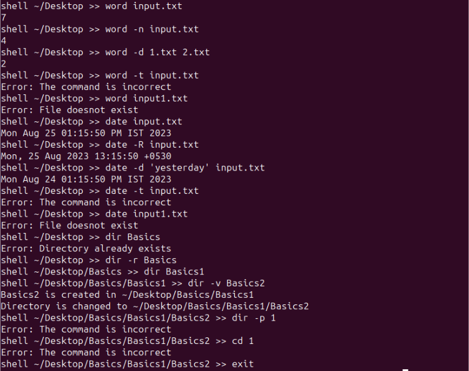

# Special Unix System Shell Project

In this project we implemented a custom shell in C with three specialized commands: `word`, `dir`, and `date`. The shell demonstrates process management, command parsing, and robust error handling. Some parts are self explanatory- uses standard method.

---

## Table of Contents

- [Features](#features)
- [Folder Structure](#folder-structure)
- [Setup & Compilation](#setup--compilation)
- [How to Run](#how-to-run)
- [Usage](#usage)
  - [word](#word)
  - [dir](#dir)
  - [date](#date)
- [Implementation Details](#implementation-details)
- [Error Handling](#error-handling)
- [Write-up](#write-up)
- [Authors](#authors)
- [License](#license)

---

## Features

- **Custom C Shell**: Command-line interface for interacting with custom commands.
- **word**: Built-in command to count words in a file, with options for newline handling and difference comparison.
- **dir**: External command to create and enter directories, with safe replace and verbose options.
- **date**: External command for displaying a file’s last modified time, with flexible output formats.

---

## Folder Structure

```
Unix System, Bash Script Programmes/
├── Makefile         # For compiling the shell and commands
├── Writeup.txt      # Brief description of how the program works

Unix System/
├── shell.c          # Main shell implementation
├── word.c           # Built-in 'word' command implementation
├── dir.c            # External 'dir' command implementation
├── date.c           # External 'date' command implementation
├── (other C files, headers)
```

---

## Setup & Compilation

1. **Clone the repository** (if you haven’t already):

    ```sh
    git clone https://github.com/Ayush-0404/OS_CSE231.git
    ```

2. **Navigate to the project directory:**

    ```sh
    cd "OS_CSE231/Unix System, Bash Script Programmes"
    ```

3. **Build the project using the provided Makefile:**

    ```sh
    make
    ```

    This will compile the shell and all command programs. Output binaries will be placed in the appropriate folder (commonly in `Unix System/`).

---

## How to Run

1. **Navigate to the folder containing the compiled shell binary.**  
   (This may be `Unix System/` or wherever `shell` is created after compilation.)

    ```sh
    cd "../Unix System"
    ```

2. **Start the shell:**

    ```sh
    ./shell
    ```

3. **Use the custom commands as described below.**

---

## Usage

### word

Counts words in a file or compares word counts.  
**Only one of `-n` or `-d` can be used at a time.**

```sh
word filename.txt
word -n filename.txt          # Ignores newline characters in word count
word -d file1.txt file2.txt   # Shows difference in word counts
```

### dir

Creates a directory and changes into it. Handles errors and supports verbose output.

```sh
dir myfolder
dir -r myfolder   # Removes existing directory if it exists, then creates it
dir -v myfolder   # Verbose output for each step
```

### date

Displays the last modified date/time of a file, with formatting options.

```sh
date file.txt
date -d "STRING" file.txt     # Display time described by STRING
date -R file.txt              # Output date in RFC 5322 format
```

---

## Implementation Details

- All commands are implemented in C using standard libraries for process, file, and directory management.
- The shell uses `fork()`, `exec()`, and `wait()` for process control and command execution.
- `word` is a built-in shell command. `dir` and `date` are executed as external commands.
- The Makefile manages compilation of all components.

---


## Screenshots

Below is the screenshots demonstrating the working of the calculator script:


<!-- Add more screenshots as needed -->

## Notes

- Ensure `input.txt` is formatted as specified.
- Only the three specified operations (`xor`, `product`, `compare`) are supported.
- The script is written purely in Bash and uses standard utilities.

## Error Handling

- Invalid commands output a clear error message.
- File/directory operations warn if targets do not exist or already exist (unless overridden by options).
- Only allowed option combinations are processed (e.g., only one of `-n` or `-d` for `word`).

---

## Write-up

See `Writeup.txt` in the "Unix System, Bash Script Programmes" folder for a concise explanation of the design and implementation approach.

---

## Authors

- Ayush-0404

---

## License

This project is for educational purposes only.
